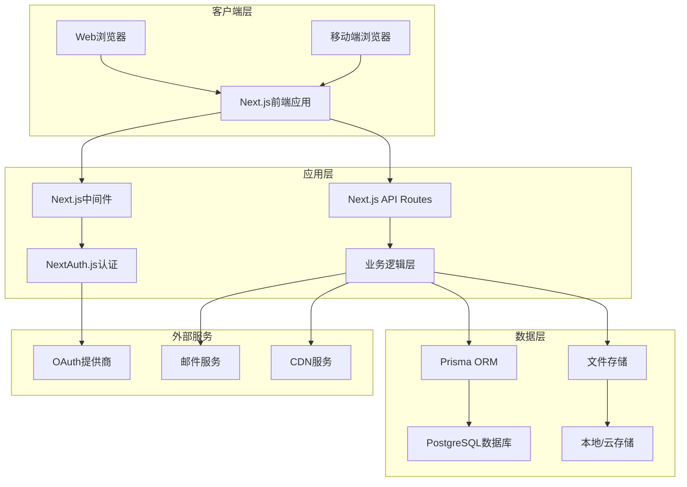
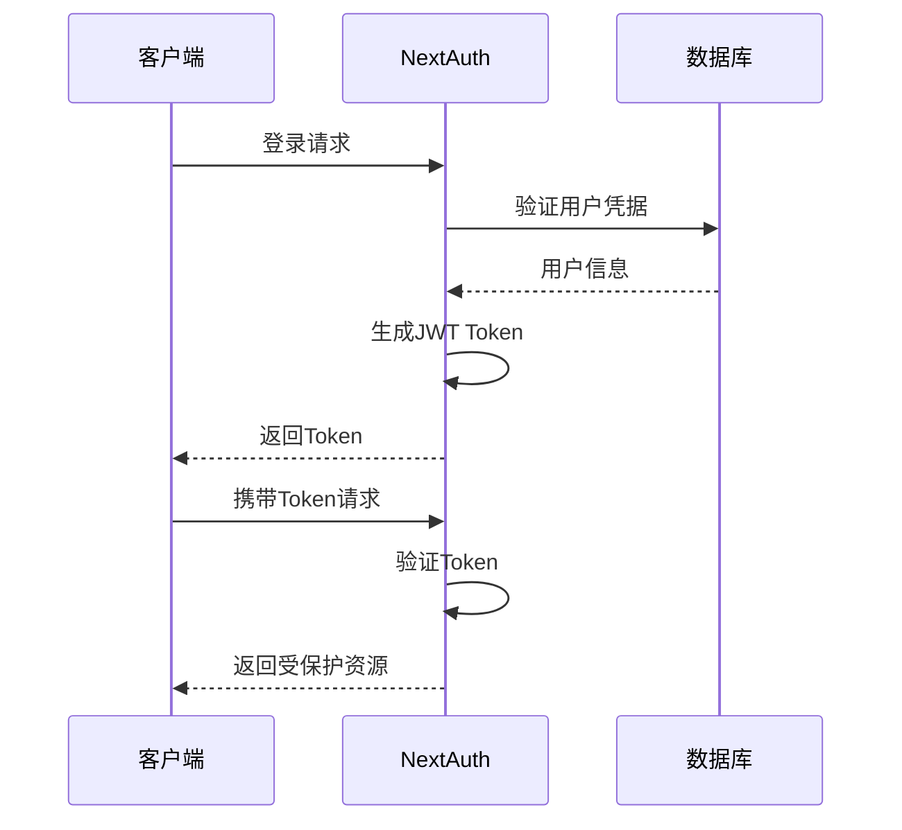
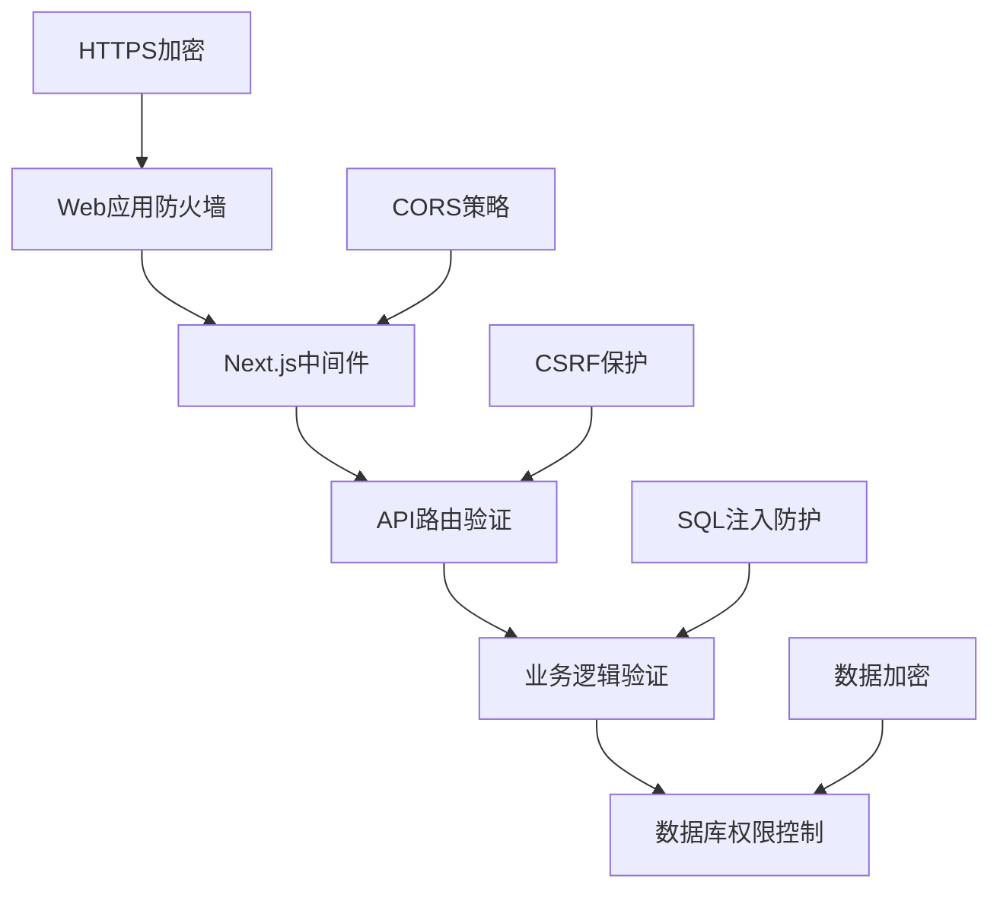

# Simple Blog 系统架构文档

## 架构概览

Simple Blog 采用现代化的全栈架构，基于 Next.js 16 的 App Router 模式构建，提供高性能、可扩展的博客系统解决方案。



## 技术栈架构

### 前端架构
- **框架**: Next.js 16.1.6 (React 19.2.3)
- **语言**: TypeScript 5
- **样式**: Tailwind CSS 4 + CSS Modules
- **状态管理**: React Hooks + Context API
- **路由**: Next.js App Router
- **表单处理**: React Hook Form + Zod验证

### 后端架构
- **运行时**: Node.js
- **API**: Next.js API Routes
- **认证**: NextAuth.js v4
- **ORM**: Prisma 7.4.2
- **数据库**: PostgreSQL
- **文件处理**: Multer + Sharp

### 基础设施
- **部署**: Vercel/Netlify
- **数据库**: Supabase PostgreSQL
- **文件存储**: 本地存储/Cloudinary
- **监控**: Vercel Analytics
- **缓存**: 内存缓存 + Redis (可选)

## 目录结构

```
simple-blog/
├── app/                          # Next.js App Router
│   ├── (auth)/                   # 认证相关页面组
│   │   ├── login/
│   │   ├── register/
│   │   └── layout.tsx
│   ├── (dashboard)/              # 管理后台页面组
│   │   ├── admin/
│   │   ├── profile/
│   │   └── layout.tsx
│   ├── blog/                     # 博客公开页面
│   │   ├── [slug]/
│   │   ├── category/
│   │   └── tag/
│   ├── api/                      # API 路由
│   │   ├── auth/
│   │   ├── posts/
│   │   ├── users/
│   │   ├── comments/
│   │   └── upload/
│   ├── globals.css
│   ├── layout.tsx
│   └── page.tsx
├── components/                   # 可复用组件
│   ├── ui/                       # 基础UI组件
│   │   ├── button.tsx
│   │   ├── input.tsx
│   │   ├── modal.tsx
│   │   └── index.ts
│   ├── forms/                    # 表单组件
│   │   ├── post-form.tsx
│   │   ├── comment-form.tsx
│   │   └── auth-form.tsx
│   ├── layout/                   # 布局组件
│   │   ├── header.tsx
│   │   ├── sidebar.tsx
│   │   └── footer.tsx
│   └── features/                 # 功能组件
│       ├── post-card.tsx
│       ├── comment-list.tsx
│       └── tag-cloud.tsx
├── lib/                          # 工具函数和配置
│   ├── auth.ts                   # NextAuth配置
│   ├── db.ts                     # 数据库连接
│   ├── utils.ts                  # 通用工具函数
│   ├── validations.ts            # Zod验证模式
│   └── constants.ts              # 常量定义
├── hooks/                        # 自定义Hooks
│   ├── use-auth.ts
│   ├── use-posts.ts
│   └── use-comments.ts
├── types/                        # TypeScript类型定义
│   ├── auth.ts
│   ├── post.ts
│   └── api.ts
├── prisma/                       # Prisma配置
│   ├── schema.prisma
│   ├── migrations/
│   └── seed.ts
├── public/                       # 静态资源
│   ├── images/
│   ├── icons/
│   └── uploads/
├── docs/                         # 文档
│   ├── PRD.md
│   └── architecture.md
└── styles/                       # 样式文件
    └── globals.css
```

## 数据库架构

### 数据库设计原则
- 使用 UUID 作为主键，提高安全性和分布式友好性
- 软删除机制，支持数据恢复
- 时间戳字段，追踪数据变更
- 外键约束，保证数据完整性

### 核心表结构

#### 用户表 (users)
```sql
CREATE TABLE users (
    id UUID PRIMARY KEY DEFAULT uuid_generate_v4(),
    name VARCHAR(100) NOT NULL,
    email VARCHAR(255) UNIQUE NOT NULL,
    password VARCHAR(255) NOT NULL,
    avatar VARCHAR(255),
    is_active BOOLEAN DEFAULT TRUE,
    role user_role DEFAULT 'viewer',
    created_at TIMESTAMP DEFAULT CURRENT_TIMESTAMP,
    updated_at TIMESTAMP DEFAULT CURRENT_TIMESTAMP
);
```

#### 文章表 (posts)
```sql
CREATE TABLE posts (
    id UUID PRIMARY KEY DEFAULT uuid_generate_v4(),
    title VARCHAR(255) NOT NULL,
    slug VARCHAR(255) UNIQUE NOT NULL,
    content TEXT NOT NULL,
    excerpt TEXT,
    cover_image VARCHAR(255),
    author_id UUID NOT NULL,
    category_id UUID,
    published BOOLEAN DEFAULT FALSE,
    published_at TIMESTAMP,
    view_count INT DEFAULT 0,
    deleted_at TIMESTAMP,
    created_at TIMESTAMP DEFAULT CURRENT_TIMESTAMP,
    updated_at TIMESTAMP DEFAULT CURRENT_TIMESTAMP
);
```

### 数据库索引策略
- **唯一索引**: 防止重复数据
- **复合索引**: 优化查询性能
- **部分索引**: 处理NULL值场景
- **全文搜索索引**: 支持内容搜索

## API架构

### RESTful API设计
```
/api/v1/
├── auth/
│   ├── POST /login              # 用户登录
│   ├── POST /register           # 用户注册
│   ├── POST /logout             # 用户登出
│   └── GET  /me                 # 获取当前用户信息
├── posts/
│   ├── GET    /                 # 获取文章列表
│   ├── POST   /                 # 创建文章
│   ├── GET    /[id]             # 获取文章详情
│   ├── PUT    /[id]             # 更新文章
│   ├── DELETE /[id]             # 删除文章
│   └── POST   /[id]/like        # 点赞文章
├── comments/
│   ├── GET    /                 # 获取评论列表
│   ├── POST   /                 # 创建评论
│   ├── PUT    /[id]             # 更新评论
│   └── DELETE /[id]             # 删除评论
├── categories/
│   ├── GET    /                 # 获取分类列表
│   ├── POST   /                 # 创建分类
│   ├── PUT    /[id]             # 更新分类
│   └── DELETE /[id]             # 删除分类
└── upload/
    └── POST   /image            # 上传图片
```

### API响应格式
```typescript
// 成功响应
{
  success: true,
  data: any,
  message?: string,
  pagination?: {
    page: number;
    limit: number;
    total: number;
    totalPages: number;
  }
}

// 错误响应
{
  success: false,
  error: {
    code: string,
    message: string,
    details?: any
  }
}
```

## 认证与授权架构

### 认证流程


### 权限控制
- **基于角色的访问控制 (RBAC)**
- **中间件权限验证**
- **API路由保护**
- **页面级权限控制**

### 角色权限矩阵
| 功能 | Admin | Editor | Viewer | 匿名用户 |
|------|-------|--------|--------|----------|
| 查看文章 | ✓ | ✓ | ✓ | ✓ |
| 创建文章 | ✓ | ✓ | ✗ | ✗ |
| 编辑文章 | ✓ | ✓(自己) | ✗ | ✗ |
| 删除文章 | ✓ | ✗ | ✗ | ✗ |
| 管理用户 | ✓ | ✗ | ✗ | ✗ |
| 评论 | ✓ | ✓ | ✓ | ✓ |
| 点赞 | ✓ | ✓ | ✓ | ✓ |

## 性能优化架构

### 前端优化
- **代码分割**: 动态导入 + 懒加载
- **图片优化**: Next.js Image组件 + WebP格式
- **缓存策略**: SWR + 内存缓存
- **Bundle优化**: Tree shaking + 压缩

### 后端优化
- **数据库优化**: 索引优化 + 查询优化
- **API缓存**: Redis缓存 + 响应缓存
- **连接池**: 数据库连接池管理
- **CDN集成**: 静态资源CDN加速

### 监控指标
- **Core Web Vitals**: LCP, FID, CLS
- **API响应时间**: P95 < 200ms
- **数据库查询时间**: < 100ms
- **错误率**: < 0.1%

## 安全架构

### 安全防护层级


### 安全措施
- **身份验证**: JWT + Session管理
- **授权控制**: RBAC + 权限中间件
- **数据保护**: bcrypt密码加密 + 敏感数据脱敏
- **攻击防护**: XSS/CSRF/SQL注入防护
- **传输安全**: HTTPS + 安全头设置

## 部署架构

### 开发环境
```
本地开发
├── Next.js开发服务器 (localhost:3000)
├── PostgreSQL本地实例
├── 文件本地存储
└── 热重载 + 调试工具
```

### 生产环境
```
Vercel部署
├── Next.js应用 (Serverless)
├── Supabase PostgreSQL
├── Vercel Blob存储
├── Vercel Analytics
└── 自动CI/CD
```

### 环境变量配置
```env
# 数据库
DATABASE_URL="postgresql://..."
DIRECT_URL="postgresql://..."

# NextAuth
NEXTAUTH_SECRET="..."
NEXTAUTH_URL="https://yourdomain.com"

# OAuth
GOOGLE_CLIENT_ID="..."
GOOGLE_CLIENT_SECRET="..."

# 文件上传
UPLOAD_DIR="./public/uploads"
MAX_FILE_SIZE="5MB"

# 邮件服务
SMTP_HOST="..."
SMTP_PORT="587"
SMTP_USER="..."
SMTP_PASS="..."
```

## 扩展性设计

### 水平扩展
- **无状态设计**: Serverless函数
- **数据库分离**: 读写分离
- **缓存层**: Redis集群
- **负载均衡**: CDN + 边缘计算

### 功能扩展
- **插件系统**: 可插拔功能模块
- **主题系统**: 可定制UI主题
- **API扩展**: GraphQL支持
- **多语言**: i18n国际化

## 监控与日志

### 应用监控
- **性能监控**: Vercel Analytics
- **错误追踪**: Sentry集成
- **用户行为**: 自定义分析
- **系统健康**: 健康检查端点

### 日志管理
- **结构化日志**: JSON格式
- **日志级别**: ERROR/WARN/INFO/DEBUG
- **日志聚合**: 集中日志收集
- **日志轮转**: 自动清理策略

---

此架构文档将随着项目发展持续更新，确保架构设计与实际实现保持同步。
